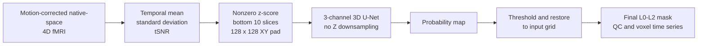

# CSFSeg Toolkit

An auditable 3-channel 3D U-Net workflow for segmenting inferior CSF regions
from lightly preprocessed 4D fMRI and extracting voxel-level time series.

This repository records the model architecture, training workflow, inference
pipeline, QC tools, tests, and aggregate ADNI baseline results. Participant
data, case-level outputs, trained weights, and private infrastructure details
are not distributed here.

## ADNI Baseline

| Item | Result |
| --- | ---: |
| Data | 50 sessions / 44 participants |
| Participant-grouped split | 41 train sessions / 9 validation sessions |
| Best checkpoint | Epoch 15 of 50 |
| Validation session-macro Dice | **0.8309** |
| Median / range | 0.8182 / 0.7778–0.9101 |
| Sessions with Dice >= 0.8 | 6 / 9 |

The validation participants did not occur in training, but the same validation
set selected the best epoch. These numbers are therefore internal validation,
not an independent test estimate. See the full [fine-tuning record](docs/adni_baseline.md)
for the protocol and interpretation boundary.

## Method



The network uses ten inferior slices as 3D spatial context while preserving
their Z resolution through every encoder and decoder stage. The baseline
checkpoint carries a segmentation contract: mean/std/tSNR channels, nonzero
z-score normalization, ten input slices, L0-L2 final output, and no automatic
reorientation or registration.

Technical safeguards include:

- participant-level train/validation separation;
- image-label geometry, orientation, binary-label, and checksum gates;
- padding-aware BCE + soft Dice loss over all ten real input layers;
- checkpoint metadata checks shared by training and inference;
- atomic best/last checkpoint writes and verified resume behavior;
- restricted `weights_only=True` checkpoint loading;
- preservation of the raw bottom-ten prediction for QC while exporting the
  contract-approved L0-L2 mask.

## Input Contract

The ADNI baseline starts from native-space 4D fMRI after motion correction and
before temporal filtering, nuisance regression, spatial smoothing, or template
registration. Other datasets may use another explicitly documented preparation,
but a trained checkpoint is only valid for the preprocessing contract it was
trained with.

The software does not turn raw DICOM data into a model-ready file. It also does
not silently reorient or register an input to make it pass geometry checks.

## Install and Verify

```bash
conda env create -f environment.yml
conda activate csfseg
pip install -e '.[dev]'
pytest -q tests
```

Run the synthetic end-to-end smoke test:

```bash
python examples/run_smoke_test.py --overwrite
```

The smoke test creates synthetic 4D data and a random 3-channel checkpoint. It
checks installation and output wiring; it does not test segmentation quality.

## Inference

A compatible trained checkpoint is required and is intentionally not included
in this public repository.

```bash
csfseg predict \
  --input /data/example_motion_corrected_4d.nii.gz \
  --out-dir /data/csfseg_outputs \
  --checkpoint /models/compatible_3ch_checkpoint.pt
```

With a contract-bearing baseline checkpoint, the main outputs are:

```text
probabilities/<output_id>_csf_prob.nii.gz
masks/<output_id>_csf_mask_bottom10_raw.nii.gz
masks/<output_id>_csf_mask_bottom10.nii.gz
qc/<output_id>_prediction_qc.png
timeseries/<output_id>_voxel_table.csv
selected/auto/<output_id>_<layer>_auto_selected_voxels.csv
reports/selection_template.csv
logs/subjects/<output_id>.log
```

The historical `bottom10` name is retained for compatibility. For the ADNI
baseline, `*_raw.nii.gz` contains the unfiltered bottom-ten threshold result;
the main mask keeps L0-L2 and writes L3+ as zero according to the checkpoint
contract. Time-series extraction and QC use the same allowed layers.

For batch inference:

```bash
csfseg batch \
  --input-paths examples/input_paths.txt \
  --out-dir /data/csfseg_outputs \
  --checkpoint /models/compatible_3ch_checkpoint.pt \
  --skip-existing
```

After QC, a layer selection can be revised without rerunning the network:

```bash
csfseg select-voxels \
  --out-dir /data/csfseg_outputs \
  --selection-file reports/selection_template.csv \
  --selection-name manual_v1
```

## Training and Reproduction

Training is driven by an explicit participant identity table and a manifest of
same-grid 4D inputs and binary labels:

```bash
csfseg prepare-training \
  --manifest /path/to/pairs.json \
  --identity-csv /path/to/participant_identity.csv \
  --output /path/to/grouped_manifest.json

csfseg train \
  --config examples/train_baseline.yaml \
  --out-dir /path/to/new_training_run
```

The example configuration contains placeholders only. Authorized data and
initialization weights must be supplied separately.

## Scope and Limitations

- This is a research segmentation aid, not a clinical device.
- The reported nine-session validation set also selected the checkpoint.
- Agreement with one manual label set does not prove anatomical ground truth.
- New scanners, protocols, preprocessing chains, orientations, and populations
  require fresh QC and validation.
- Generated logs and NIfTI outputs can retain source paths or header metadata;
  they are not automatically anonymized publication artifacts.

## Documentation

- [ADNI baseline record](docs/adni_baseline.md)
- [Quickstart](docs/quickstart.md)
- [Input formats](docs/input_format.md)
- [Commands](docs/commands.md)
- [Output files](docs/outputs.md)
- [QC figures](docs/qc.md)
- [Model checkpoints](docs/model_checkpoints.md)
- [Design notes](docs/design.md)

## License

The software is released under the [MIT License](LICENSE). The license does not
grant rights to participant data, derived case-level artifacts, or third-party
model weights.
